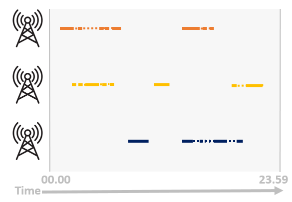

# Call Detail Records
Call Detail Records data comes from the record of each event for which a telco company need to keep track for billing purposes. Differently from GPS data, CDR data are not collected for location usage purposes, so the main aim of the event generating the data is not the one of being spatially accurate but giving a good service like not making the call brake down or browse the internet as fast as possible. This good service provision is performed thank to optimization network routines, for example one applied routine is ’if the nearest cell is too much crowded connect to another cell’. While these routines makes the service working well it complicates the things for analysis purposes, indeed happens that a certain subject, without no real movements is moved from a certain cell to another one for optimization reasons. On location analytics side the change of cell will be read as a movement while in reality no moves has been done.

# Dwelling time
Call Detail Records refers to the cell network derived data; and as we already said the location analysis use of this kind of data is opportunistic,
these data has not been collected to run analysis. The main aim of the cellphone and network protocols is to guarantee the best experience to the
users and so the principal aim is to perform well in terms of connectivity to the net. This behavior has an impact on the recorded events trajectory, creating
some spurious movements not coming from the real person movements but from the network optimization routines. Indeed what we observed in row
CDR data is a systematic ’pin-pong’ behaviour between cells. For example for a non moving person browsing the internet we can see a series of short
events on different cells, creating a pin-pong between the cells itself. In this case the observed series of events does not reflects the reality, the person was
browsing the internet always in the same position; so we need to detect this spurious movements and filter them out. Filtering this kind of unrealistic movemts corresponds to going from CDR estimated location to Dwelling time locations.

The logic behind our approach relies on the assumption that when a person triggers a cell with an event, for a certain amount of time we are still able to find it under the area covered by the triggered cell even if no events occurs. In 2018 Chen et al worked on this topic, studing how to enrich sparce trajectory[1]. In their work it has been shown how the hypotheses of finding a person under the same cell after a short amount of time after an event (call, message) is satisfied. So
we exploited the evidences shown in Chen et al work in order to define a pipeline able to spot and recover from ’pin-pong’ effect.

# Dwelling algorithm
The first step of our method is to merge all the events on the same cell that are less distant that 15 minutes one with respect to the other. In this
way we end up having less observation that are on average longer than what we had before; the logic behind this first step is the one already presented:
we suppose that if a person does two events on the same cell in a window shorter than 15 minutes, it means that the person didn’t moved to another
area during the minutes between the recorded events. This first step aggregates events on the same cell, but actually when pin-
pong happens we end up with many events on different cells in a short time span. The first step aggregates the events and so after the merging step we
can have two observation in the same time window on two different cells. Due to this reason we need to decide ’which observation is correct’, and so
we need to try to manage the overlapping time frame in order to approximate it as much truthfully as possible. Our approach here is to compare
the observations insisting on the same time span and assign the overlapping time frame to the cell that registered the longest events. Conceptually this
is a good approximation of what happens in reality due to the fact that we are assigning the most stable cell, the one that we sow for a longer time
period. Indeed, as we said before, the nearest we are to a cell the higher the probability of being connected to it; so as a consequence the most probable
cell for the overlapping time window is the cell that registered the longest event.

Below a visual representation of the logic behind the algorithm.

1. CDR raw data visualization:

2. Dwelling algorithm - Merging step

3. Dwelling algorithm - Overlapping step

